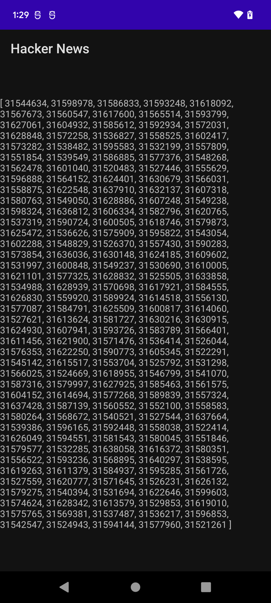
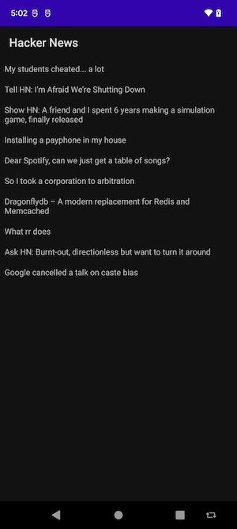

# HackerNews app

This NDK example app shows the top articles from HackerNews using the [JSON API](https://github.com/HackerNews/API).

It is adapted from the [curl-ssl](https://github.com/android/ndk-samples/tree/main/prefab/curl-ssl)
example app, but with the intention of being more pedagogical.

It shows how configure and use pre-built open-source libraries from
[com.android.ndk.thirdparty](https://maven.google.com/web/index.html?q=com.android.ndk.thirdparty#com.android.ndk.thirdparty).

There are 3 parts to this tutorial:

 1. Creating a default "Hello, world" C++ app.
 2. Modifying the default app to fetch HTTP data using libcurl and openssl.
 3. Decoding and manipulating the JSON data.

## Part 1: App creation

### Install Android Studio and the NDK

* Install [Android Studio](https://developer.android.com/studio).
* Open the [SDK manager](https://developer.android.com/studio/intro/update#sdk-manager) in Android
  Studio, and [install the NDK](https://developer.android.com/studio/projects/install-ndk).

### Create a C++ project

Create a new "Native C++" project in Android Studio. Refer to the instructions
[here](https://developer.android.com/studio/projects/add-native-code#new-project).

### Run the app

The app should display "Hello, world".

## Part 2: Fetching data with HTTP

### Add openssl and curl to app/build.gradle and enable prefab and shared libraries

```diff
diff --git a/hackernews/app/build.gradle b/hackernews/app/build.gradle
index aaa5b76..cccd9ff 100644
--- a/hackernews/app/build.gradle
+++ b/hackernews/app/build.gradle
@@ -17,6 +17,7 @@ android {
         externalNativeBuild {
             cmake {
                 cppFlags ''
+                arguments '-DANDROID_STL=c++_shared'
             }
         }
     }
@@ -43,14 +44,18 @@ android {
     buildFeatures {
         viewBinding true
     }
+    buildFeatures {
+        prefab true
+    }
 }

 dependencies {
-
     implementation 'androidx.core:core-ktx:1.7.0'
     implementation 'androidx.appcompat:appcompat:1.3.0'
     implementation 'com.google.android.material:material:1.4.0'
     implementation 'androidx.constraintlayout:constraintlayout:2.0.4'
+    implementation 'com.android.ndk.thirdparty:openssl:1.1.1l-beta-1'
+    implementation 'com.android.ndk.thirdparty:curl:7.79.1-beta-1'
     testImplementation 'junit:junit:4.13.2'
     androidTestImplementation 'androidx.test.ext:junit:1.1.3'
     androidTestImplementation 'androidx.test.espresso:espresso-core:3.4.0'
```

### Permit the app to access the internet

Add to app/src/main/AndroidManifest.xml:

`<uses-permission android:name="android.permission.INTERNET" />`

### Add root certificates for OpenSSL

As described in the [curl-ssl README](https://github.com/android/ndk-samples/blob/main/prefab/curl-ssl/README.md):

> The root certificates presented by Android since ICS are not in the format OpenSSL expects, so we
> need to provide our own certificate file.

You can follow the instructions in [this Stack Overflow
post](https://stackoverflow.com/a/31521185/632035) or simply copy them from [here](https://github.com/android/ndk-samples/blob/main/prefab/curl-ssl/app/src/main/assets/cacert.pem).

### Write the Kotlin code and define the cross-language API

Edit app/src/main/java/com/example/hackernews/MainActivity.kt.

Get the certificate file from the assets:

```kotlin
private val cacert by lazy {
    val path = cacheDir.resolve("cacert.pem")
    assets.open("cacert.pem").copyTo(FileOutputStream(path))
    path
}
```

Pass the certificate file to the native method. Replace `external fun stringFromJNI(): String` with:

```kotlin
external fun getHackerNews(cacert: String): String
```

Call the new method. Replace `binding.sampleText.text = stringFromJNI()` with:

```kotlin
binding.sampleText.text = getHackerNews(cacert.path)
```

### Write the C++ code.

Add the following files. Refer to the code in GitHub for their contents.

* app/src/main/cpp/http.cpp
* app/src/main/cpp/http.h
* app/src/main/cpp/java_interop.h
* app/src/main/cpp/logging.cpp
* app/src/main/cpp/logging.h

Then, update native-lib.cpp:

```C++
extern "C" JNIEXPORT jstring JNICALL
Java_com_example_hackernews_MainActivity_getHackerNews(
        JNIEnv *env,
        jobject /* this */,
        jstring cacert_java) {
    if (cacert_java == nullptr) {
        hackernews::logging::FatalError(env, "cacert argument cannot be null");
    }

    const std::string cacert =
            hackernews::jni::Convert<std::string>::from(env, cacert_java);
    auto client = hackernews::http::Client(cacert);
    std::string error;
    auto result = client.get(
            "https://hacker-news.firebaseio.com/v0/beststories.json?print=pretty",
            &error);
    if (!result) {
        return env->NewStringUTF(error.c_str());
    }
    return env->NewStringUTF(result->c_str());
}
```

### Edit the C++ build instructions

Update CMakeLists.txt:

```diff
diff --git a/hackernews/app/src/main/cpp/CMakeLists.txt b/hackernews/app/src/main/cpp/CMakeLists.txt
index 6866733..d50478d 100644
--- a/hackernews/app/src/main/cpp/CMakeLists.txt
+++ b/hackernews/app/src/main/cpp/CMakeLists.txt
@@ -9,6 +9,8 @@ cmake_minimum_required(VERSION 3.18.1)

 project("hackernews")

+find_package(curl REQUIRED CONFIG)
+
 # Creates and names a library, sets it as either STATIC
 # or SHARED, and provides the relative paths to its source code.
 # You can define multiple libraries, and CMake builds them for you.
@@ -21,8 +23,13 @@ add_library( # Sets the name of the library.
         SHARED

         # Provides a relative path to your source file(s).
+        logging.cpp
+        http.cpp
         native-lib.cpp)

+set_target_properties(hackernews PROPERTIES CXX_STANDARD 17)
+target_compile_options(hackernews PRIVATE -Wall -Werror)
+
 # Searches for a specified prebuilt library and stores the path as a
 # variable. Because CMake includes system libraries in the search path by
 # default, you only need to specify the name of the public NDK library
@@ -43,6 +50,8 @@ find_library( # Sets the name of the path variable.
 target_link_libraries( # Specifies the target library.
         hackernews

+        curl::curl
+
         # Links the target library to the log library
         # included in the NDK.
         ${log-lib})
```

### Build and run the app

You should see a raw JSON list of HackerNews article IDs:



### Troubleshooting

* If you get a DNS error, it may be because you haven't given the app permission to access the internet.

## Part 3: JSON decoding

### Add jsoncpp to the build files

In app/build.gradle, dependencies section: `implementation 'com.android.ndk.thirdparty:jsoncpp:1.9.5-beta-1'`

In app/src/main/cpp/CMakeLists.txt: `find_package(jsoncpp REQUIRED CONFIG)`, and add `jsoncpp::jsoncpp` to target_link_libraries

### Write the C++ code

Change the method signature to return a `jobjectArray` instead of a `jstring`. We'll also
use a separate function to get the article titles:

```C++
extern "C" JNIEXPORT jobjectArray JNICALL
Java_com_example_hackernews_MainActivity_getHackerNews(
        JNIEnv *env,
        jobject /* this */,
        jstring cacert_java) {
    if (cacert_java == nullptr) {
        hackernews::logging::FatalError(env, "cacert argument cannot be null");
    }

    const std::string cacert =
            hackernews::jni::Convert<std::string>::from(env, cacert_java);
    return hackernews::jni::Convert<jobjectArray, jstring>::from(env,
                                                   hackernews::GetTitles(cacert));

}
```

Now, `#include "json/json.h"` and use it to implement GetTitles. Decode the array of stories, and fetch the
details for the top ~10. (It gets slow if you fetch too many. Parallelizing the requests is left as
a TODO.) For the exact details, refer to [app/src/main/cpp/native-lib.cpp]

### Update the app layout

The curl-ssl app on which this is based uses a ListView, which is deprecated. We'll do something
better.

#### Change activity_main.xml to be a RecyclerView inside a LinearLayout

```xml
<?xml version="1.0" encoding="utf-8"?>
<LinearLayout xmlns:android="http://schemas.android.com/apk/res/android"
    xmlns:app="http://schemas.android.com/apk/res-auto"
    xmlns:tools="http://schemas.android.com/tools"
    android:layout_width="match_parent"
    android:layout_height="match_parent"
    tools:context=".MainActivity">

    <androidx.recyclerview.widget.RecyclerView
        android:id="@+id/recycler_view"
        android:layout_width="match_parent"
        android:layout_height="match_parent"
        android:orientation="vertical"
        app:layoutManager="androidx.recyclerview.widget.LinearLayoutManager"
        tools:listitem="@layout/list_item" />
</LinearLayout>
```

#### Add a new list_item.xml that's a TextView inside a ConstraintLayout

This is the layout used for each list item, and will display the article title.

```xml
<?xml version="1.0" encoding="utf-8"?>
<androidx.constraintlayout.widget.ConstraintLayout xmlns:android="http://schemas.android.com/apk/res/android"
    android:orientation="vertical"
    android:padding="8dp"
    android:layout_width="match_parent"
    android:layout_height="wrap_content">

    <TextView
        android:id="@+id/textView"
        android:layout_width="match_parent"
        android:layout_height="wrap_content"
        android:text="TextView" />
</androidx.constraintlayout.widget.ConstraintLayout>
```

### Add an adapter for the RecyclerView

Add app/src/main/java/com/example/hackernews/NewsAdapter.kt. The implementation basically follows
the example in https://developer.android.com/guide/topics/ui/layout/recyclerview

```kotlin
package com.example.hackernews

import android.view.LayoutInflater
import android.view.View
import android.view.ViewGroup
import android.widget.TextView
import androidx.recyclerview.widget.RecyclerView

class NewsAdapter(private val dataSet: Array<String>) :
        RecyclerView.Adapter<NewsAdapter.ViewHolder>() {
    class ViewHolder(view: View) : RecyclerView.ViewHolder(view) {
        val textView: TextView

        init {
            textView = view.findViewById(R.id.textView)
        }
    }

    override fun onCreateViewHolder(viewGroup: ViewGroup, viewType: Int): ViewHolder {
        val view = LayoutInflater.from(viewGroup.context)
                .inflate(R.layout.list_item, viewGroup, false)

        return ViewHolder(view)
    }

    override fun onBindViewHolder(viewHolder: ViewHolder, position: Int) {
        viewHolder.textView.text = dataSet[position]
    }

    override fun getItemCount() = dataSet.size
}
```

### Update MainActivity

Our native function now returns an array of strings: `external fun getHackerNews(cacert: String): Array<String>`

Then, we need to initialize and use the adapter:

```kotlin
    private lateinit var adapter: NewsAdapter

    override fun onCreate(savedInstanceState: Bundle?) {
        super.onCreate(savedInstanceState)
        setContentView(R.layout.activity_main)

        adapter = NewsAdapter(getHackerNews(cacert.path))

        val recyclerView: RecyclerView = findViewById(R.id.recycler_view)
        recyclerView.adapter = adapter
    }
```

### Build and run the app



### Additional resources

* https://developer.android.com/guide/topics/ui/layout/recyclerview
* https://medium.com/@vanshbadkul/json-parsing-hacker-news-api-on-android-9b0fd8b21b88